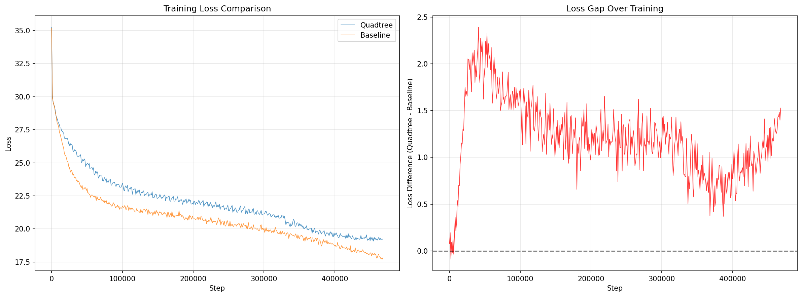
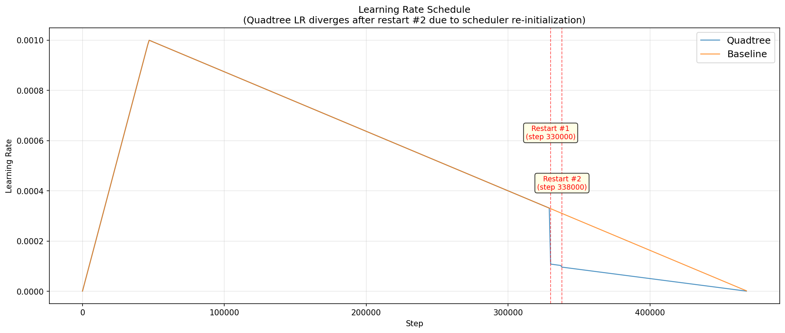
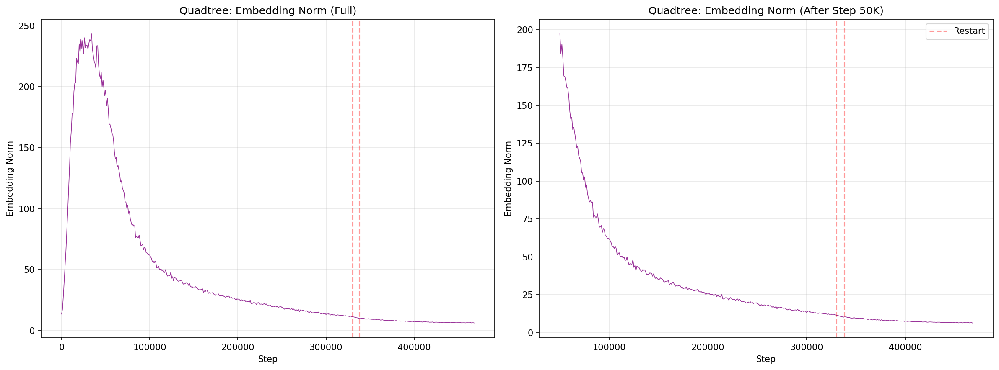
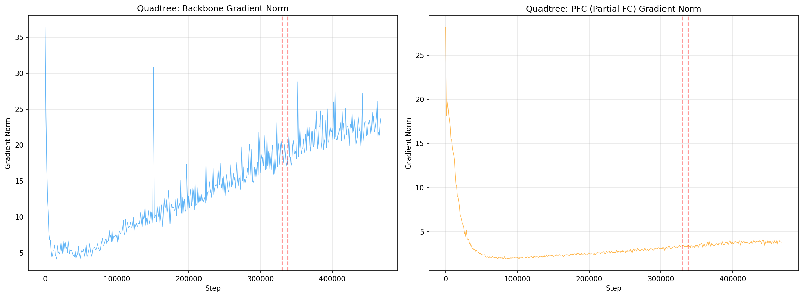
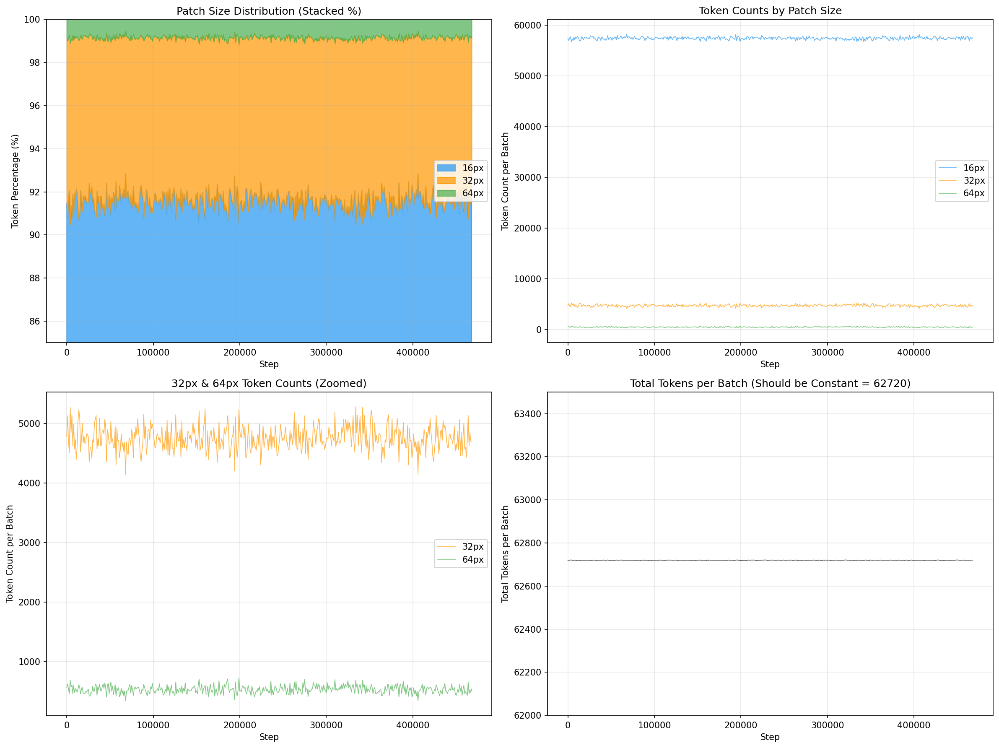
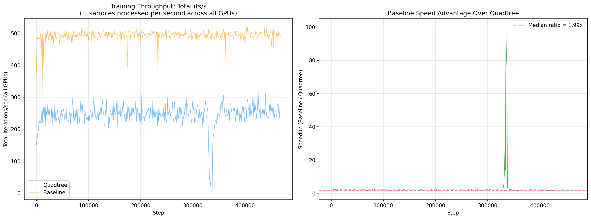
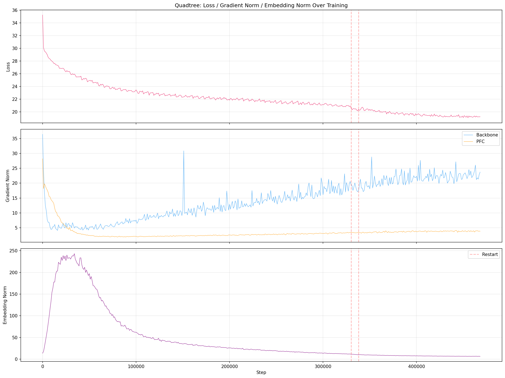
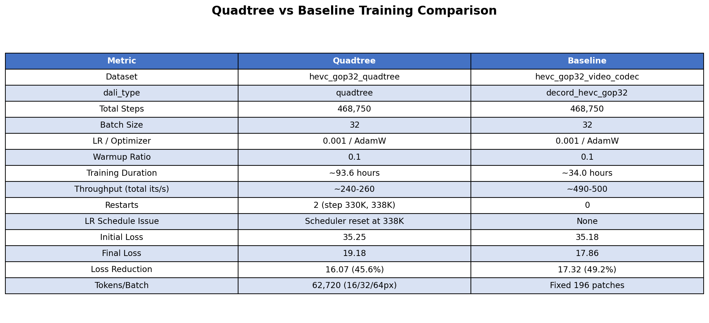

# ViT Training Log: Quadtree vs Baseline

## Overview

Training log comparison between **Quadtree** (multi-resolution patch) and **Baseline** (fixed-resolution) approaches for video face recognition using ViT-Small on HEVC GOP32 data.

## Configuration

| Metric | Quadtree | Baseline |
|---|---|---|
| Dataset | `hevc_gop32_quadtree` | `hevc_gop32_video_codec` |
| dali_type | `quadtree` | `decord_hevc_gop32` |
| Total Steps | 468,750 | 468,750 |
| Batch Size | 32 | 32 |
| LR / Optimizer | 0.001 / AdamW | 0.001 / AdamW |
| Warmup Ratio | 0.1 | 0.1 |
| Training Duration | ~93.6 hours | ~34.0 hours |
| Throughput (total its/s) | ~240-260 | ~490-500 |
| Restarts | 2 (step 330K, 338K) | 0 |
| Initial Loss | 35.25 | 35.18 |
| **Final Loss** | **19.18** | **17.86** |
| Tokens/Batch | 62,720 (16/32/64px) | Fixed 196 patches |

## Visualizations

### 1. Loss Comparison


### 2. Learning Rate Schedule
Quadtree LR diverges after restart #2 (step 338K) due to scheduler re-initialization.


### 3. Quadtree: Embedding Norm


### 4. Quadtree: Gradient Norms


### 5. Quadtree: Token / Patch Distribution


### 6. Throughput Comparison


### 7. Quadtree: Loss / Grad Norm / Embed Norm Combined


### 8. Summary Table


## How to Reproduce

```bash
python visualize.py
```

## File Structure

```
.
├── logs/
│   ├── quadtree_hevc_gop32.logger    # Quadtree full training log
│   ├── baseline_mvres_4gpu.logger    # Baseline full training log
│   ├── quadtree_data.csv             # Extracted quadtree metrics
│   ├── quadtree_loss.csv             # Extracted quadtree loss
│   ├── baseline_data.csv             # Extracted baseline metrics
│   └── baseline_loss.csv             # Extracted baseline loss
├── figures/
│   ├── 01_loss_comparison.png
│   ├── 02_learning_rate.png
│   ├── 03_embedding_norm.png
│   ├── 04_gradient_norms.png
│   ├── 05_token_distribution.png
│   ├── 06_throughput.png
│   ├── 07_quadtree_combined.png
│   └── 08_summary_table.png
├── visualize.py
└── README.md
```
