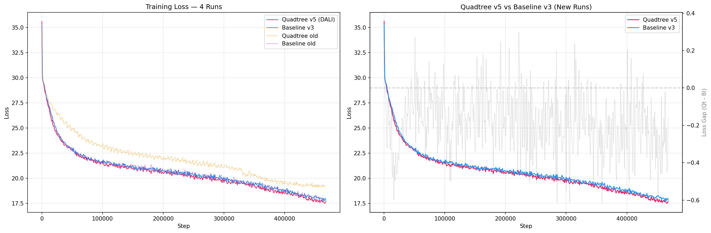
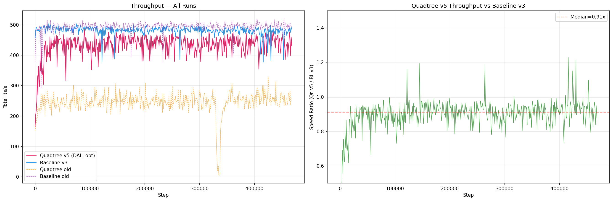
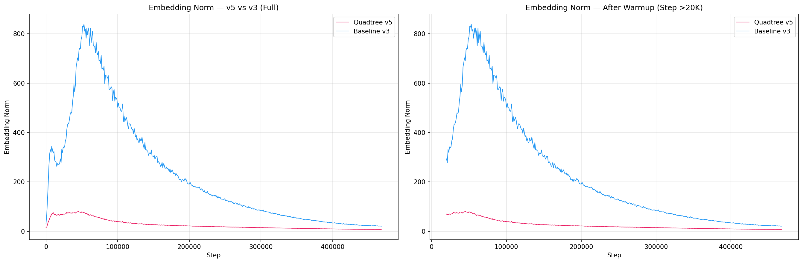
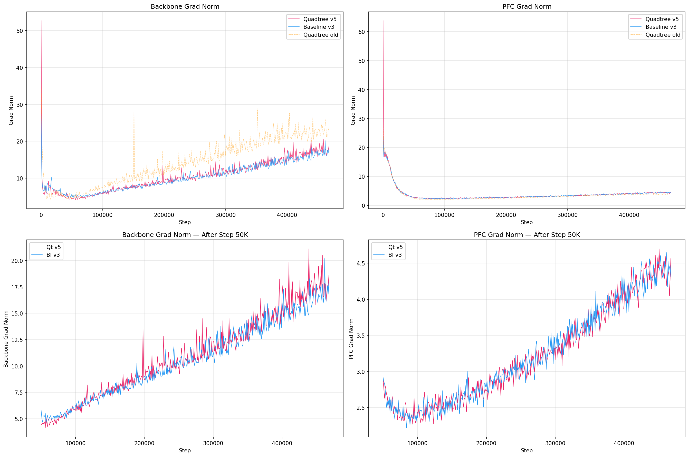
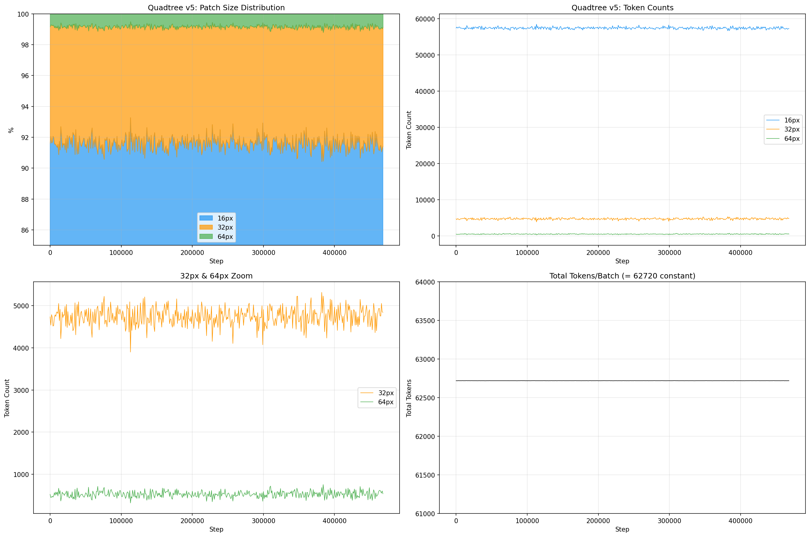
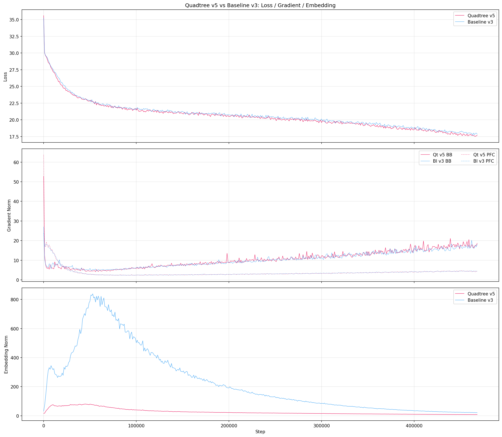
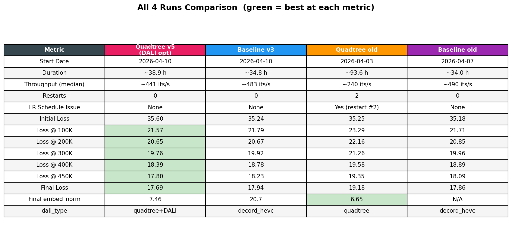

# ViT Training Log: Quadtree vs Baseline

## Overview

Training log comparison for video face recognition using ViT-Small (HEVC GOP32 data).
Two generations of experiments are included:

- **v5 / v3** (new): Quadtree with DALI optimization vs updated Baseline
- **old** (reference): Original Quadtree vs original Baseline

---

## Results Summary (New Runs: v5 vs v3)

| Metric | Quadtree v5 (DALI opt) | Baseline v3 |
|---|---|---|
| Start Date | 2026-04-10 | 2026-04-10 |
| Duration | ~38.9 hours | ~34.8 hours |
| Throughput (median) | ~441 its/s | ~483 its/s |
| Restarts | **0** | 0 |
| LR Schedule Issue | None | None |
| Initial Loss | 35.60 | 35.24 |
| Loss @ 100K | **21.57** | 21.79 |
| Loss @ 200K | **20.65** | 20.67 |
| Loss @ 300K | **19.76** | 19.92 |
| Loss @ 400K | **18.39** | 18.78 |
| Loss @ 450K | **17.80** | 18.23 |
| **Final Loss** | **17.69** | 17.94 |
| Final embed_norm | 7.46 | 20.7 |
| dali_type | quadtree + DALI | decord_hevc_gop32 |

**Key finding:** Quadtree v5 achieves **lower final loss (17.69 vs 17.94)** than Baseline v3, while having comparable throughput (~441 vs ~483 its/s). This is a reversal from the old runs where quadtree was worse.

---

## All 4 Runs Comparison

| Metric | Quadtree v5 | Baseline v3 | Quadtree old | Baseline old |
|---|---|---|---|---|
| Duration | ~38.9 h | ~34.8 h | ~93.6 h | ~34.0 h |
| Throughput | ~441 its/s | ~483 its/s | ~240 its/s | ~490 its/s |
| Restarts | 0 | 0 | 2 | 0 |
| LR Issue | No | No | Yes (restart #2) | No |
| Final Loss | **17.69** | 17.94 | 19.18 | 17.86 |

---

## Visualizations (New Runs: v5 vs v3)

### 1. Loss Comparison (All 4 Runs)


### 2. Throughput


### 3. Embedding Norm

> Note: Baseline v3 embed_norm peaks at ~800 then declines, while Quadtree v5 stays low (~7-16 range). This suggests very different representational dynamics.

### 4. Gradient Norms (Backbone & PFC)


### 5. Quadtree v5: Token Distribution


### 6. Combined: Loss / Gradient / Embedding


### 7. Summary Table


---

## Original Runs Visualizations

### Loss Comparison (Old Runs)


### Learning Rate (with restart annotation)


### Quadtree Metrics (Old)


---

## How to Reproduce

```bash
# New runs (v5 vs v3)
python visualize_v2.py

# Old runs
python visualize.py
```

## File Structure

```
.
├── logs/
│   ├── quadtree_dali_v5.logger         # Quadtree v5 (DALI opt) full log
│   ├── baseline_mvres_4gpu_v3.logger   # Baseline v3 full log
│   ├── quadtree_hevc_gop32.logger      # Quadtree old full log
│   ├── baseline_mvres_4gpu.logger      # Baseline old full log
│   ├── qt_v5_data.csv / qt_v5_loss.csv
│   ├── bl_v3_data.csv / bl_v3_loss.csv
│   ├── quadtree_data.csv / quadtree_loss.csv
│   └── baseline_data.csv / baseline_loss.csv
├── figures_v2/                         # New run visualizations
├── figures/                            # Old run visualizations
├── visualize_v2.py                     # Script for new runs
├── visualize.py                        # Script for old runs
└── README.md
```
